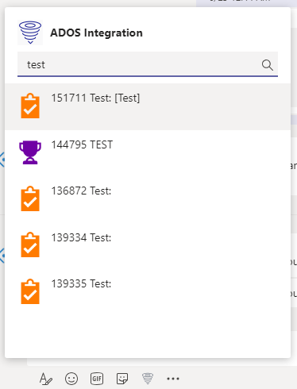
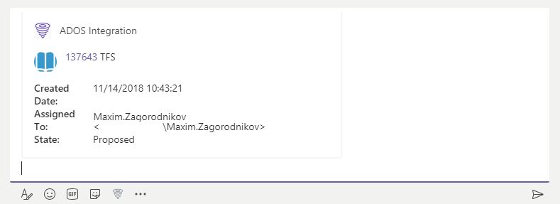

# ados2teams
Extension for Microsoft Teams to integrate data from Azure DevOps Server into teams conversations. As for now supports only messaging extension to search work items and send result into conversation as Adaptive Card.

||
|---|
||

This is a pet project where were two main goals: 1) add support for search of work items from Local Azure DevOps Server to MS Teams; 2) try new ways and approaches with bot framework, .net core, etc. 

So do not expect clean nice code, there is no one:) But it works ;)

## Getting Started

Basically this project relies on, so please read it first:
  * Getting started with Teams apps: https://docs.microsoft.com/en-us/microsoftteams/platform/get-started/get-started-dotnet-app-studio
  * "How to" article about developing messaging extension: https://docs.microsoft.com/en-us/microsoftteams/platform/concepts/messaging-extensions/search-extensions
  * [Bot Framework v4](https://www.google.com/url?sa=t&rct=j&q=&esrc=s&source=web&cd=13&cad=rja&uact=8&ved=2ahUKEwjEr6a3-r3jAhV15KYKHc3kDeoQFjAMegQIAxAB&url=https%3A%2F%2Fdev.botframework.com%2F&usg=AOvVaw1fJCMkLuoJiBQAKTyDzh-U), [project templates for Visual Studio](https://marketplace.visualstudio.com/items?itemName=BotBuilder.botbuilderv4) and [Bot Builder MS Teams Extension](https://github.com/OfficeDev/BotBuilder-MicrosoftTeams) preview with .Net Core support

Also there are some prerequisites:
  * app uses PAT to access Azure devOps Server API, so you need to get one as described here: https://docs.microsoft.com/en-us/azure/devops/organizations/accounts/use-personal-access-tokens-to-authenticate?view=azure-devops, PAT should have ability to read workitems

To set up your local dev env basically you should use steps from https://docs.microsoft.com/en-us/microsoftteams/platform/get-started/get-started-dotnet-app-studio:
1. Host bot web service with ngrok locally or in Azure (see details here: https://docs.microsoft.com/en-us/microsoftteams/platform/get-started/get-started-dotnet-app-studio)
2. Register your bot and add app to Teams using manifest template file placed [here](/ADOS2TeamsBot/TeamsAppManifest/manifest_template.json), just insert correct ID for your registered bot
3. Add your appsettings.json file with parameters as below
  ```JSON
  {
  "MicrosoftAppId": "Your App Id here",
  "MicrosoftAppPassword": "Your App Password here",
  "ADOSBaseUri": "Url to your Azure DevOps Server here",
  "ADOSSecret": "Secret for authorization on Azure DevOps Server",
  "ADOSCollection": "Name of Azure DevOps Server collection where to search"
  }
  ```
5. If you want to use automated tests add *.runsettings file to store params like this:
  ```XML
  <RunSettings>
  <TestRunParameters>
    <Parameter name="ADOSUrl" value="URL to Azure DevOps Collection like https://ados.domain.com/collectionname" />
    <Parameter name="basicQuery" value="query string to find something" />
    <Parameter name="epicId" value="id of the epic to check that we found appropriate image" />
  </TestRunParameters>
</RunSettings>
  ```

## Deployment

Please see Getting started with Teams apps: https://docs.microsoft.com/en-us/microsoftteams/platform/get-started/get-started-dotnet-app-studio about deployment options

## Credits
Icons made by [GraphicsBay](https://www.flaticon.com/authors/graphicsbay) from [Flaticon](https://www.flaticon.com/) is licensed by [Creative Commons BY 3.0](http://creativecommons.org/licenses/by/3.0/)

## Contributing
Please read [CONTRIBUTING.md](/Contributing.md) for details on.

## License
[MIT](https://github.com/maximza/ados2teams/blob/master/LICENSE)